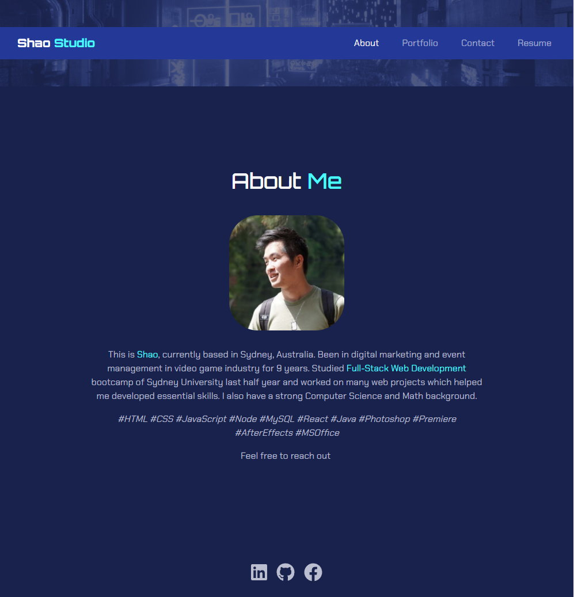
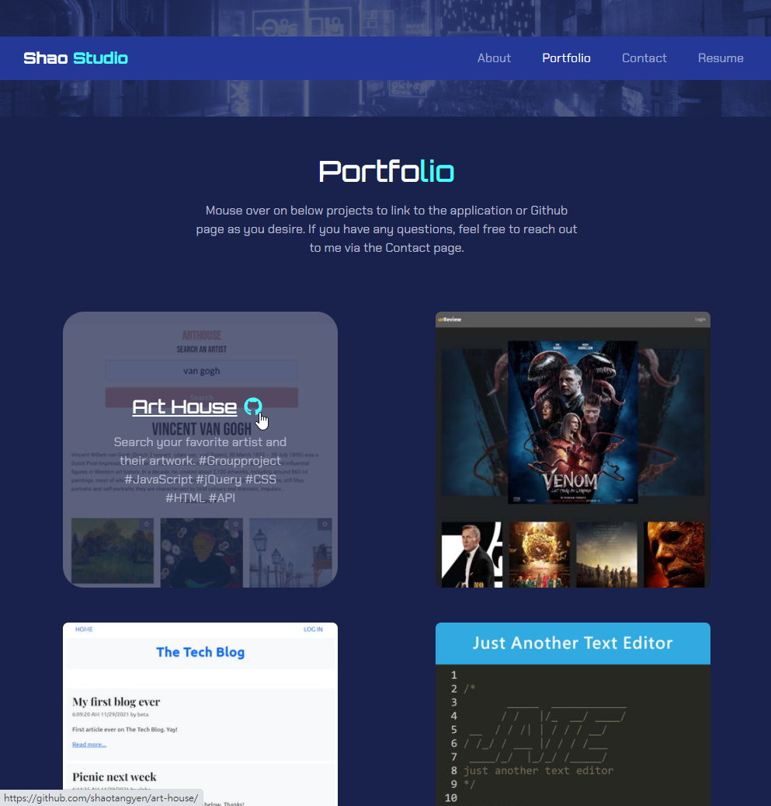

# Portfolio-react

This is an updated Portfolio website using React & JavaScript. The site has an introduction, showcases project portfolios, links to each project, a contact form and downloadable resume.

## Table of Contents
1. [Setup](#setup)
2. [Design](#design)
3. [Links](#links)
4. [Screenshots](#screenshots)
5. [License](#license)

## Setup

You can visit the [deployed website on GitHub Page](https://shaotangyen.github.io/portfolio-react/), or download the codes and run it using [React](https://create-react-app.dev/docs/getting-started/).

To install React, you need to type ``npx create-react-app [folder-name]`` then type ``npm i && npm start``.

## Design

* Mobile-first responsiveness design
* The code mainly uses React
* Styling is based on bootstrap with owned color plate and CSS styles
* Using Insomnia to run and test the application and its functions

## Links

Please check out [deployed website on Github Page](https://shaotangyen.github.io/portfolio-react/) for the app, or check out [GitHub](https://github.com/shaotangyen/portfolio-react) for all codes.

## Screenshots

## License

Copyright 2021 Shao Yen

Permission is hereby granted, free of charge, to any person obtaining a copy of this software and associated documentation files (the "Software"), to deal in the Software without restriction, including without limitation the rights to use, copy, modify, merge, publish, distribute, sublicense, and/or sell copies of the Software, and to permit persons to whom the Software is furnished to do so, subject to the following conditions:

The above copyright notice and this permission notice shall be included in all copies or substantial portions of the Software.

THE SOFTWARE IS PROVIDED "AS IS", WITHOUT WARRANTY OF ANY KIND, EXPRESS OR IMPLIED, INCLUDING BUT NOT LIMITED TO THE WARRANTIES OF MERCHANTABILITY, FITNESS FOR A PARTICULAR PURPOSE AND NONINFRINGEMENT. IN NO EVENT SHALL THE AUTHORS OR COPYRIGHT HOLDERS BE LIABLE FOR ANY CLAIM, DAMAGES OR OTHER LIABILITY, WHETHER IN AN ACTION OF CONTRACT, TORT OR OTHERWISE, ARISING FROM, OUT OF OR IN CONNECTION WITH THE SOFTWARE OR THE USE OR OTHER DEALINGS IN THE SOFTWARE.